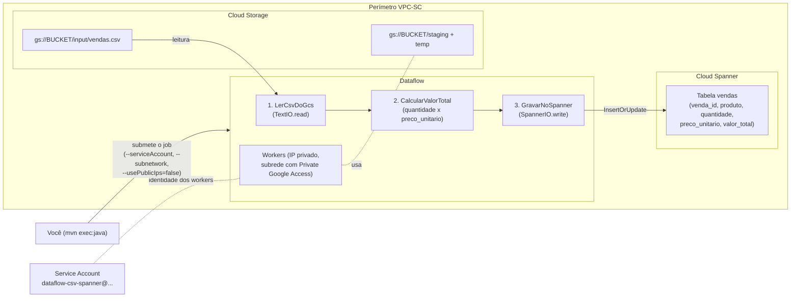

# sample-dataflow-job

Job **Apache Beam / Google Cloud Dataflow em Java**, bem didático, que:

1. Lê um arquivo CSV de vendas no **Cloud Storage**;
2. Calcula o valor total de cada venda (`quantidade * preco_unitario`);
3. Grava o resultado na tabela `vendas` do **Cloud Spanner**.

O passo a passo abaixo inclui **todas as linhas de comando**, a criação da
**service account** com as permissões mínimas necessárias e os **parâmetros de
rede para ambientes com VPC Service Controls (VPC-SC)**.

---

## Arquitetura da execução



Fluxo resumido: você submete o job com Maven → o Dataflow sobe workers **sem IP
público** dentro da sua subrede (dentro do perímetro VPC-SC) → os workers leem o
CSV do bucket, calculam o total e escrevem no Spanner. Tudo acontece dentro do
perímetro; nenhum tráfego sai para a internet.

---

## Estrutura do repositório

```
sample-dataflow-job/
├── pom.xml                                  # Dependências (Beam + conectores GCP)
├── data/
│   └── vendas.csv                           # Dados fake de exemplo
└── src/main/java/com/example/dataflow/
    └── CsvToSpannerPipeline.java            # O pipeline (bem comentado)
```

O CSV de exemplo (`data/vendas.csv`):

```csv
venda_id,produto,quantidade,preco_unitario
V001,Teclado Mecanico,3,250.00
V002,Mouse Gamer,5,120.50
V003,Monitor 27 Polegadas,2,1450.00
...
```

---

## Pré-requisitos

- [gcloud CLI](https://cloud.google.com/sdk/docs/install) instalado e autenticado (`gcloud auth login`);
- **Credenciais de aplicação (ADC)**: o Maven/Beam NÃO usa a credencial do
  `gcloud auth login`, e sim as *Application Default Credentials*. Rode também:

  ```bash
  gcloud auth application-default login
  ```

  > ⚠️ Se você estiver rodando de dentro de uma **VM do GCE / Cloud Shell / Cloud
  > Workstations**, a ADC é a **service account da VM** — é ELA quem submete o
  > job e precisa dos papéis de "quem submete" da tabela do Passo 4.
- **Java 17** e **Maven 3.8+**;
- Um projeto GCP com billing ativo. Se precisar criar um:

  ```bash
  gcloud projects create meu-projeto-df --name="demo-dataflow"
  gcloud billing projects link meu-projeto-df --billing-account=SEU_BILLING_ACCOUNT_ID
  ```

  > 💡 IDs de projeto começando com `demo` são rejeitados pelo GCP
  > (`project_id contains prohibited words`). Use, por exemplo, `dataflow-demo-...`.
- Permissão para criar service accounts e conceder papéis IAM no projeto;
- Se o projeto está em um perímetro **VPC-SC**: os serviços `dataflow.googleapis.com`, `storage.googleapis.com` e `spanner.googleapis.com` devem estar protegidos **no mesmo perímetro** (ou com regras de ingress/egress adequadas).

---

## Passo 0 — Variáveis de ambiente

Ajuste os valores e cole no seu terminal. Todos os comandos seguintes usam essas variáveis.

```bash
export PROJECT_ID="meu-projeto"                # seu projeto GCP
export PROJECT_NUMBER=$(gcloud projects describe $PROJECT_ID --format='value(projectNumber)')
export REGION="us-central1"                    # região do job e dos recursos
export BUCKET="${PROJECT_ID}-dataflow-sample"  # bucket para CSV + staging

export SPANNER_INSTANCE="sample-instance"
export SPANNER_DB="vendas-db"

export SA_NAME="dataflow-csv-spanner"
export SA_EMAIL="${SA_NAME}@${PROJECT_ID}.iam.gserviceaccount.com"

# Rede (obrigatório em VPC-SC: workers sem IP público, em subrede sua)
export NETWORK="minha-vpc"
export SUBNETWORK="minha-subrede"

gcloud config set project $PROJECT_ID
```

---

## Passo 1 — Habilitar as APIs

```bash
gcloud services enable \
  dataflow.googleapis.com \
  compute.googleapis.com \
  storage.googleapis.com \
  spanner.googleapis.com
```

---

## Passo 2 — Criar o bucket e subir o CSV fake

```bash
# Cria o bucket (uniform access, região igual à do job)
gcloud storage buckets create gs://$BUCKET \
  --location=$REGION \
  --uniform-bucket-level-access

# Sobe o arquivo de dados fake
gcloud storage cp data/vendas.csv gs://$BUCKET/input/vendas.csv

# Confere
gcloud storage cat gs://$BUCKET/input/vendas.csv
```

---

## Passo 3 — Criar a instância, o banco e a tabela no Spanner

```bash
# Instância pequena (100 processing units) — suficiente para o exemplo
gcloud spanner instances create $SPANNER_INSTANCE \
  --config=regional-$REGION \
  --description="Instancia de exemplo Dataflow" \
  --processing-units=100

# Banco de dados
gcloud spanner databases create $SPANNER_DB \
  --instance=$SPANNER_INSTANCE

# Tabela de destino
gcloud spanner databases ddl update $SPANNER_DB \
  --instance=$SPANNER_INSTANCE \
  --ddl='CREATE TABLE vendas (
    venda_id       STRING(36) NOT NULL,
    produto        STRING(100),
    quantidade     INT64,
    preco_unitario FLOAT64,
    valor_total    FLOAT64
  ) PRIMARY KEY (venda_id)'
```

---

## Passo 4 — Criar a service account e conceder as permissões

Os **workers do Dataflow** rodam com a identidade desta service account. Ela
precisa de exatamente 3 coisas: ser worker do Dataflow, ler/escrever no bucket
e escrever no Spanner.

```bash
# 4.1 Cria a service account
gcloud iam service-accounts create $SA_NAME \
  --display-name="Dataflow CSV -> Spanner (exemplo)"

# 4.2 Papel de worker do Dataflow (obrigatório para qualquer job)
#     (--condition=None evita prompt interativo em orgs que usam IAM conditions)
gcloud projects add-iam-policy-binding $PROJECT_ID \
  --member="serviceAccount:$SA_EMAIL" \
  --role="roles/dataflow.worker" \
  --condition=None

# 4.3 Acesso ao bucket (ler o CSV + escrever staging/temp)
gcloud storage buckets add-iam-policy-binding gs://$BUCKET \
  --member="serviceAccount:$SA_EMAIL" \
  --role="roles/storage.objectAdmin"

# 4.4 Escrita no banco do Spanner (papel concedido só no banco, não no projeto)
gcloud spanner databases add-iam-policy-binding $SPANNER_DB \
  --instance=$SPANNER_INSTANCE \
  --member="serviceAccount:$SA_EMAIL" \
  --role="roles/spanner.databaseUser"

# 4.5 QUEM SUBMETE o job precisa poder "usar" essa service account
gcloud iam service-accounts add-iam-policy-binding $SA_EMAIL \
  --member="user:$(gcloud config get-value account)" \
  --role="roles/iam.serviceAccountUser"
```

> ⚠️ **Se quem submete NÃO é você** (ex.: rodando de uma VM, cuja ADC é a
> service account da VM), conceda a essa identidade os papéis de submissão:
>
> ```bash
> export SUBMITTER="serviceAccount:SA_DA_SUA_VM@developer.gserviceaccount.com"
>
> gcloud projects add-iam-policy-binding $PROJECT_ID \
>   --member="$SUBMITTER" --role="roles/dataflow.developer" --condition=None
>
> # Precisa ser storage.admin no bucket: o Beam valida o bucket com
> # storage.buckets.get, permissão que roles/storage.objectAdmin NÃO tem.
> gcloud storage buckets add-iam-policy-binding gs://$BUCKET \
>   --member="$SUBMITTER" --role="roles/storage.admin"
>
> gcloud iam service-accounts add-iam-policy-binding $SA_EMAIL \
>   --member="$SUBMITTER" --role="roles/iam.serviceAccountUser"
> ```

### Resumo das permissões

| Quem | Papel | Onde | Para quê |
|------|-------|------|----------|
| `dataflow-csv-spanner@...` | `roles/dataflow.worker` | Projeto | Workers executarem o job |
| `dataflow-csv-spanner@...` | `roles/storage.objectAdmin` | Bucket | Ler CSV, escrever staging/temp |
| `dataflow-csv-spanner@...` | `roles/spanner.databaseUser` | Banco `vendas-db` | Escrever na tabela `vendas` |
| Quem submete (você ou SA da VM) | `roles/dataflow.developer` | Projeto | Submeter/gerenciar jobs |
| Quem submete (você ou SA da VM) | `roles/storage.admin` | Bucket | Subir os jars de staging (o Beam exige `storage.buckets.get`) |
| Quem submete (você ou SA da VM) | `roles/iam.serviceAccountUser` | Service account | Anexar a SA ao job |
| `service-PROJECT_NUMBER@dataflow-service-producer-prod.iam.gserviceaccount.com` | `roles/dataflow.serviceAgent` | Projeto | Agente do Dataflow (criado/concedido automaticamente ao habilitar a API) |

> 💡 Se você já é `Owner`/`Editor` do projeto, os papéis de usuário acima já estão cobertos.

---

## Passo 5 — Rede em ambiente VPC-SC

Em um perímetro VPC-SC, os workers **não podem ter IP público** e precisam
alcançar as APIs do Google pela rede privada.

**5.0 — Se você ainda não tem VPC/subrede** (muitas orgs apagam a rede
`default` via org policy `compute.skipDefaultNetworkCreation` — o erro típico é
`The resource '.../subnetworks/default' was not found`):

```bash
gcloud compute networks create $NETWORK --subnet-mode=custom

gcloud compute networks subnets create $SUBNETWORK \
  --network=$NETWORK \
  --region=$REGION \
  --range=10.10.0.0/24 \
  --enable-private-ip-google-access   # já cria com PGA; Passo 5.1 vira opcional
```

**5.1 — A subrede precisa de Private Google Access habilitado** (é assim que os
workers, sem IP público, alcançam Cloud Storage/Spanner):

```bash
gcloud compute networks subnets update $SUBNETWORK \
  --region=$REGION \
  --enable-private-ip-google-access
```

**5.2 — Firewall: os workers do Dataflow precisam falar entre si** (portas
12345-12346, para o shuffle de dados):

```bash
gcloud compute firewall-rules create dataflow-internal \
  --network=$NETWORK \
  --action=allow \
  --direction=ingress \
  --rules=tcp:12345-12346 \
  --source-tags=dataflow \
  --target-tags=dataflow
```

**5.3 — Parâmetros de rede que vão na execução do job** (já incluídos no
Passo 6):

| Parâmetro | Valor | Por quê |
|-----------|-------|---------|
| `--usePublicIps=false` | — | Workers só com IP privado (exigência típica do perímetro) |
| `--subnetwork` | URL completa da subrede | Workers sobem na SUA subrede, dentro do perímetro |
| `--network` | Nome da VPC | Necessário quando a subrede não está na rede `default` |
| `--region` | Mesma região da subrede | Evita job sem capacidade de rede |

> ⚠️ **VPC-SC**: o projeto do bucket, do Spanner e do job Dataflow devem estar
> **dentro do mesmo perímetro**. Se o DNS da sua VPC aponta as APIs do Google
> para `restricted.googleapis.com` (199.36.153.4/30), nada muda nos comandos —
> o Private Google Access resolve o acesso.

---

## Passo 6 — Executar o job 🚀

```bash
mvn clean compile exec:java \
  -Dexec.mainClass=com.example.dataflow.CsvToSpannerPipeline \
  -Dexec.args=" \
    --runner=DataflowRunner \
    --project=$PROJECT_ID \
    --region=$REGION \
    --jobName=csv-para-spanner \
    --tempLocation=gs://$BUCKET/temp \
    --stagingLocation=gs://$BUCKET/staging \
    --serviceAccount=$SA_EMAIL \
    --network=$NETWORK \
    --subnetwork=https://www.googleapis.com/compute/v1/projects/$PROJECT_ID/regions/$REGION/subnetworks/$SUBNETWORK \
    --usePublicIps=false \
    --maxNumWorkers=2 \
    --inputFile=gs://$BUCKET/input/vendas.csv \
    --instanceId=$SPANNER_INSTANCE \
    --databaseId=$SPANNER_DB"
```

O que cada parâmetro faz:

| Parâmetro | Descrição |
|-----------|-----------|
| `--runner=DataflowRunner` | Executa no Dataflow (e não localmente) |
| `--serviceAccount` | Identidade dos workers (a SA do Passo 4) |
| `--network` / `--subnetwork` | Rede/subrede privada (VPC-SC) |
| `--usePublicIps=false` | Sem IP público nos workers (VPC-SC) |
| `--tempLocation` / `--stagingLocation` | Onde o Dataflow guarda jars e arquivos temporários |
| `--inputFile` / `--instanceId` / `--databaseId` | Parâmetros do NOSSO pipeline (definidos em `Options`) |

Acompanhe o job:

```bash
# Lista os jobs na região
gcloud dataflow jobs list --region=$REGION

# Ou abra no console:
# https://console.cloud.google.com/dataflow/jobs
```

> 💻 **Testar localmente primeiro (opcional, sem Dataflow):** troque
> `--runner=DataflowRunner` por `--runner=DirectRunner` e use um caminho local
> no `--inputFile` (ex.: `data/vendas.csv`). O DirectRunner ainda precisa de
> credenciais para escrever no Spanner (`gcloud auth application-default login`).

---

## Passo 7 — Verificar o resultado no Spanner

```bash
gcloud spanner databases execute-sql $SPANNER_DB \
  --instance=$SPANNER_INSTANCE \
  --sql='SELECT venda_id, produto, quantidade, preco_unitario, valor_total
         FROM vendas ORDER BY venda_id'
```

Saída esperada (o `valor_total` foi calculado pelo job):

```
venda_id  produto               quantidade  preco_unitario  valor_total
V001      Teclado Mecanico      3           250             750
V002      Mouse Gamer           5           120.5           602.5
V003      Monitor 27 Polegadas  2           1450            2900
...
V007      Hub USB-C             6           89.9            539.4000000000001
...
```

> 💡 Notou o `539.4000000000001`? É a imprecisão binária do `FLOAT64`
> (6 × 89.90). Em sistemas financeiros reais, use o tipo `NUMERIC` no Spanner
> e `BigDecimal` no Java.

---

## Passo 8 — Limpeza (evitar cobranças) 🧹

```bash
# Apaga a instância do Spanner (apaga bancos e dados junto!)
gcloud spanner instances delete $SPANNER_INSTANCE --quiet

# Apaga o bucket e tudo dentro
gcloud storage rm -r gs://$BUCKET

# Apaga a service account
gcloud iam service-accounts delete $SA_EMAIL --quiet

# Apaga a regra de firewall
gcloud compute firewall-rules delete dataflow-internal --quiet

# Ou, se o projeto foi criado só para este exemplo, apague tudo de uma vez:
gcloud projects delete $PROJECT_ID
```

---

## Erros comuns e como resolver

| Erro | Causa provável | Solução |
|------|----------------|---------|
| `Request is prohibited by organization's policy` (VPC-SC) | Recurso fora do perímetro ou chamada vinda de fora | Confirme que projeto/bucket/Spanner estão no mesmo perímetro; rode os comandos de dentro de uma máquina autorizada |
| `Workflow failed... unable to reach...` | Subrede sem Private Google Access | Rode o comando do Passo 5.1 |
| `Current user cannot act as service account` | Falta `iam.serviceAccountUser` | Rode o comando 4.5 |
| Job fica preso em "Starting" | Firewall bloqueando portas 12345-12346 | Rode o comando do Passo 5.2 |
| `PERMISSION_DENIED: spanner.sessions.create` | SA sem acesso ao banco | Rode o comando 4.4 |
| `403 Forbidden ... does not have storage.buckets.get` ao submeter | ADC de quem submete sem acesso ao bucket (comum em VM: a ADC é a SA da VM, não seu usuário) | Conceda os papéis de submissão à identidade da ADC (caixa do Passo 4.5); aguarde ~1 min a propagação do IAM |
| `The resource '.../subnetworks/default' was not found` | Org policy apagou a rede `default` | Crie VPC e subrede (Passo 5.0) |
| Job roda mas nenhum log aparece no terminal (`SLF4J: ... NOP logger`) | Binding slf4j 2.x com slf4j-api 1.7 do Beam | Use `slf4j-simple` 1.7.x (já corrigido no `pom.xml`) |

---

## Licença

Uso livre para fins educacionais. Dados 100% fictícios.
